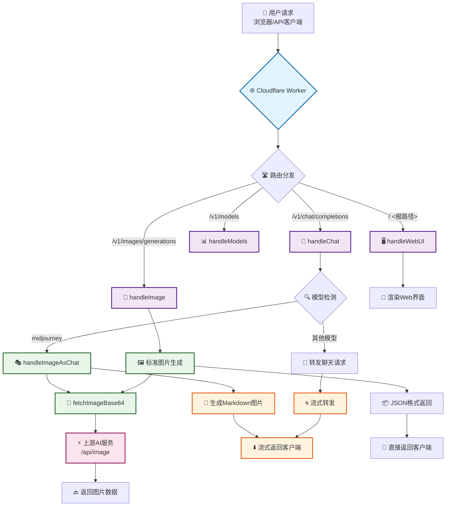

# 🚀 HackAIGC-2API (v7.0) - 智能双模 AI 适配器 🚀

[](https://opensource.org/licenses/Apache-2.0)
[](https://deploy.workers.cloudflare.com/?url=https://github.com/lza6/hackaigc-2api-cfwork)
[](https://github.com/lza6/hackaigc-2api-cfwork)
[]()

> "我们不是在编写代码，我们是在铸造连接思想的桥梁。每一个函数，都是通往未来可能性的一扇门。" —— 2API Project

欢迎来到 **HackAIGC-2API v7.0** 的世界！这不仅仅是一个简单的 Cloudflare Worker 脚本，它是一个**智能的、自适应的、充满魔法的 AI 网关**。它能优雅地解决一个普遍的痛点：**如何在不修改前端或客户端的情况下，让它们无缝支持原本不兼容的 AI 功能（比如在聊天应用里画图）？**

---

## ✨ 核心亮点

### 🧠 智能双模适配
同一个模型名称 (`midjourney`)，在我们的 Web UI 里会调用原生图片接口，在第三方 API 客户端（如 Cherry Studio, NextChat）里会自动转换成 Markdown 图片格式返回。**前端无感，后端智能！**

### 🎨 原生绘图体验
解决了 v6 及之前版本在 Web UI 中显示 `raw json` 或 Markdown 乱码的问题。现在，浏览器直接渲染高清图片，所见即所得！

### 🤖 API 客户端的智能适配
当 API 客户端将绘图请求发送到 `/chat/completions` 时，我们的 Worker 会在云端拦截，画好图，再伪装成完美的 Markdown 聊天消息流式返回。客户端体验完美！

### ☁️ 一键部署 & 免费托管
基于 Cloudflare Worker，只需要点击按钮，就能拥有一个属于自己的、高性能的、遍布全球的 AI 代理服务，而且基本**零成本**！

### 🔑 统一访问入口
将多个上游 AI 服务（聊天、绘图等）聚合到一个统一的 API 地址和密钥下，极大简化了多服务管理。

---

## 🎯 解决的问题

### 传统方式的痛点 😭
- 客户端把 `midjourney` 请求发往 `/chat/completions` 接口
- 后端要么报错，要么返回难以理解的 JSON 数据
- 用户体验被技术细节破坏

### HackAIGC-2API 的解决方案 ✨
1. **智能拦截**：识别发往聊天接口的绘图请求
2. **透明转换**：调用真正的绘图服务并等待结果
3. **格式适配**：将图片包装成 Markdown 格式返回
4. **无缝体验**：客户端正常显示图片，无需任何修改

**技术哲学**：技术应该为人服务，让复杂隐于无形，让创造力自由流动。

---

## 🛠️ 一键部署

### 快速开始（推荐）

1. **点击部署按钮** 👇
   
   [](https://deploy.workers.cloudflare.com/?url=https://github.com/lza6/hackaigc-2api-cfwork)

2. **登录/注册 Cloudflare 账号**

3. **授权并命名项目**
   - 授权 GitHub 访问
   - 为项目命名（如 `my-ai-gateway`）
   - 点击 **"Deploy"**

4. **配置环境变量**
   - 进入 Worker 仪表盘
   - `Settings` → `Variables` → `Environment Variables`
   - 添加变量：`API_MASTER_KEY = sk-your-secret-key-here`
   - 点击 `Save and Deploy`

### 🎉 部署完成！
你的 AI 网关已上线运行：
- **API Base URL**: `https://<你的项目名>.<你的子域>.workers.dev/v1`
- **API Key**: 你设置的 `API_MASTER_KEY`

---

## 👨‍💻 手动部署

### 步骤说明
1. 登录 Cloudflare Dashboard
2. 选择 `Workers & Pages` → `Create application` → `Create Worker`
3. 命名并部署
4. 点击 `Edit code`，复制本项目代码到编辑器
5. 配置环境变量（推荐）或修改代码中的 `CONFIG`
6. 点击 `Save and Deploy`

### 使用指南

#### 场景一：API 客户端配置
- **API 地址**: `https://<你的Worker地址>/v1`
- **API Key**: 你的 `API_MASTER_KEY`
- **支持模型**: `gpt-4o`（聊天）、`midjourney`（绘图）

#### 场景二：Web UI 访问
- 访问 Worker 地址（不加 `/v1`）
- 体验原生的聊天和绘图界面

---

## 🔬 技术架构

### 📂 项目结构
```
.
└── index.js          # 核心逻辑：路由、适配器、UI界面
```

### 🏗️ 系统架构图



### ⚙️ 核心模块详解

| 模块 | 功能 | 技术要点 | 复杂度 |
|------|------|----------|---------|
| **`fetch(request)`** | 请求分发中心 | 基于路径的路由，CORS 处理 | ⭐☆☆☆☆ |
| **`handleChat`** | 聊天请求处理器 | 模型检测，TransformStream 流式转发 | ⭐⭐⭐☆☆ |
| **`handleImageAsChat`** | 智能绘图适配器 | 请求转换，Markdown 包装，流式模拟 | ⭐⭐⭐⭐☆ |
| **`handleImage`** | 标准图片接口 | OpenAI 格式兼容，Base64 返回 | ⭐⭐☆☆☆ |
| **`fetchImageBase64`** | 绘图核心引擎 | 二进制处理，格式转换 | ⭐⭐☆☆☆ |
| **`arrayBufferToBase64`** | 编码转换器 | 分块处理大文件，避免栈溢出 | ⭐⭐⭐☆☆ |
| **`handleWebUI`** | 交互界面 | 服务端渲染，实时通信 | ⭐⭐☆☆☆ |

### 🔧 关键技术

#### 🌀 流式处理 (TransformStream)
```javascript
// 实时转发上游响应，保持流式特性
const { readable, writable } = new TransformStream({
    transform(chunk, controller) {
        // 实时处理数据块
        controller.enqueue(chunk);
    }
});
```

#### 🎭 智能适配模式
```javascript
// 检测到绘图请求时自动转换
if (model === 'midjourney') {
    return handleImageAsChat(userMessage, env);
}
```

#### 📦 格式兼容
- **Web UI**: 原生图片渲染 (`data:image/png;base64,...`)
- **API 客户端**: Markdown 兼容 (``)

---

## 📈 项目现状与发展

### ✅ 已实现功能 (v7.0)

- ✅ **智能路由分发** - 自动识别并处理不同类型请求
- ✅ **双模显示适配** - Web UI 与 API 客户端完美兼容  
- ✅ **流式响应支持** - 保持实时交互体验
- ✅ **统一配置管理** - 简化多服务集成
- ✅ **一键部署方案** - 极简运维体验

### 🚧 待优化项目

1. **错误处理增强** - 更友好的错误提示和恢复机制
2. **动态配置支持** - 环境变量驱动的模型映射
3. **性能缓存优化** - KV 存储集成，减少重复请求
4. **功能扩展性** - 插件化架构，支持更多 AI 服务
5. **监控统计** - 请求追踪和用量分析

### 🚀 未来规划

#### 短期目标 (v7.1)
- 🔄 **配置外部化** - 支持通过环境变量配置模型映射
- 📊 **基础监控** - 添加请求计数和基础统计
- 🐛 **错误处理优化** - 更优雅的错误响应

#### 中期目标 (v7.5)  
- ⚡ **智能缓存** - Cloudflare KV 集成，缓存绘图结果
- 🎯 **多模型支持** - 扩展支持 DALL-E、Stable Diffusion 等
- 🔐 **多租户支持** - 多 API Key 管理和限额控制

#### 长期愿景 (v8.0)
- 🌐 **通用适配器框架** - 支持任意 AI 服务接入
- 📱 **移动端优化** - 响应式设计和移动端适配
- 🔌 **插件生态系统** - 社区驱动的功能扩展

---

## 🤝 贡献指南

### 开发环境搭建
1. 克隆项目仓库
2. 安装 Wrangler CLI
3. 配置本地环境变量
4. 运行开发服务器

### 代码规范
- 使用清晰的函数命名和注释
- 保持模块化设计
- 添加必要的错误处理
- 维护文档更新

### 提交规范
- `feat`: 新功能
- `fix`: 问题修复  
- `docs`: 文档更新
- `refactor`: 代码重构

---

## 🐛 故障排除

### 常见问题

**Q: 部署后返回 401 错误**
A: 检查 `API_MASTER_KEY` 环境变量是否正确设置，并在请求头中携带正确的 Authorization。

**Q: 绘图功能不工作**
A: 确认上游绘图服务可用，检查网络连接和 API 配置。

**Q: Web UI 无法访问**
A: 确认访问的是根路径（无 `/v1`），检查 Worker 部署状态。

### 调试技巧
- 使用 Cloudflare Worker 日志查看请求详情
- 检查网络请求的路径和头部信息
- 验证环境变量配置

---

## 📜 开源协议

本项目采用 **Apache License 2.0** 开源协议。

### 你可以自由地：
- ✅ 商业使用
- ✅ 修改源代码  
- ✅ 分发副本
- ✅ 私人使用

### 你需要：
- 📝 保留版权和许可声明
- 📝 声明代码变更

**简单来说**：随便用，但请署名。我们相信开放和分享是推动技术进步的最佳方式。

---

## 🌟 致谢

感谢所有为这个项目做出贡献的开发者、测试者和用户。特别感谢：

- **Cloudflare** 提供优秀的边缘计算平台
- **开源社区** 的宝贵反馈和建议
- **早期采用者** 的耐心测试和问题反馈

---

> **"技术应该服务于创造力，而不是成为创造力的障碍。"**  
> 让我们一起构建更智能、更友好的 AI 应用生态！

**Happy Coding! 🚀**
